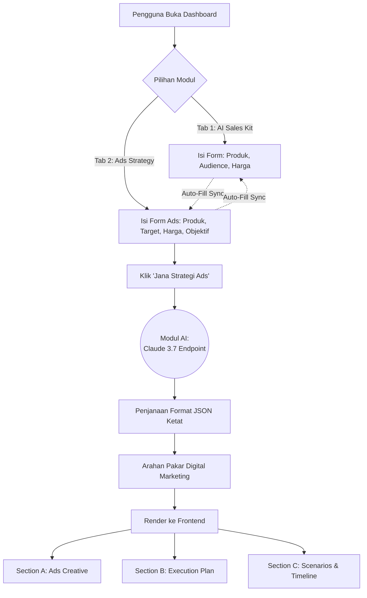
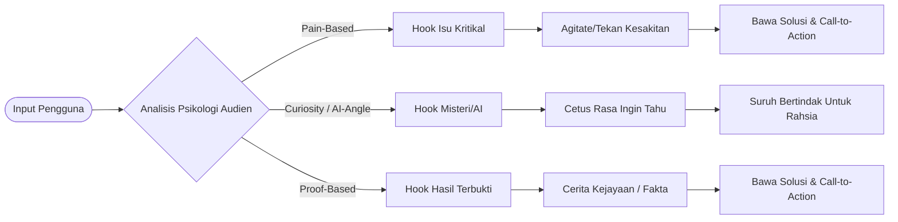
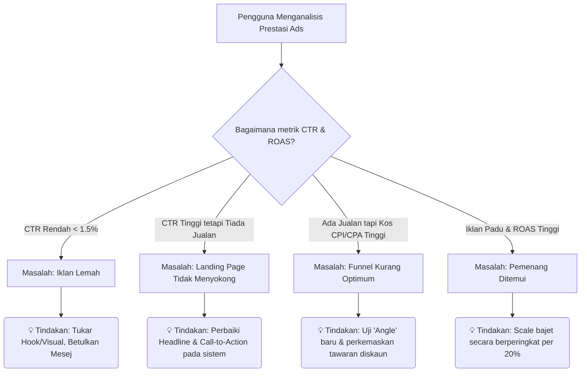

# 📊 Modul Ads Creative & Strategy: Workflow & Decision Tree

Dokumen ini menerangkan aliran kerja (workflow) lengkap bermula daripada pengguna memasukkan data, sehinggalah bagaimana kepakaran AI menentukan corak keputusan (decision tree) untuk menghasilkan strategi pengiklanan yang tepat.

---

## 1. Keseluruhan Aliran Sistem / System Workflow

Berikut merupakan aliran data daripada pengguna (User) kepada Enjin AI dan kembali sebagai strategi yang visualisasinya disusun secara teratur (Accordion style).

---

## 2. Decision Tree: Keputusan Di Sebalik Tabir (AI Logic)

Modul **Ads Creative & Strategy** bukanlah sekadar menjana teks rawak. Ia diarahkan oleh kerangka pemasaran *performance marketing* yang ketat membahagikannya kepada beberapa keputusan bersasar.

### 🎯 Section A: Ads Creative (Pemilihan Angle Iklan)
Berdasarkan deskripsi produk dan "Target Audience" pengguna, AI akan menjana 3 sudut iklan yang unik. Keputusan dibuat secara serentak mengikut tiga matlamat psikologi berbeza:

### 📈 Section B & Timeline: Strategi Fasa (Execution Engine)
Tindakan apa yang perlu dilakukan pada bila-bila masa tertentu sepanjang kempen berjalan.

1. **Fasa 1: EXPLORE (Hari 1 hingga Hari 3)**
   - **Tindakan Pokok**: Hanya biarkan algoritma mencari ruang jualan (Broad + Advantage+). Jangan ubah iklan.
2. **Fasa 2: CONTROL (Hari 4 hingga Hari 7)**
   - **Tindakan Pokok**: Mula buat optimasi sekiranya matriks prestasi turun; matikan iklan gagal (*Kill losers*).
3. **Fasa 3: SCALE (Minggu Ke-2 dan ke atas)**
   - **Tindakan Pokok**: Tambah bajet sekiranya margin tercapai, mula mencari kelompok serupa (Lookalike audience).

---

### 🧠 Section C: Scenario Action Generator (Trigger -> Action)

Ini adalah bahagian enjin diagnostik iklan bagi menyelesaikan masalah biasa pengguna yang tidak tahu punca ketiadaan untung. Ini adalah senario yang diprogramkan untuk AI pecahkan mengikut situasi:

## Kesimpulan

Gabungan di antara **Auto-Sync Input**, **Arahan Pengkhususan AI (3 Sudut Psikologi)**, dan **Output Diagnostik (Senario & Fasa)**, menjadikan modul ini seumpama sebuah agen perunding teknikal iklan yang lengkap di dalam poket pakar jualan (micro-entrepreneurs). Tiada beban visual kerana setiap modul diikat melalui kawalan Accordion moden.
